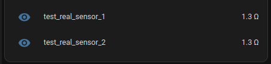
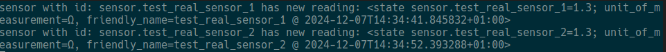

# Dev guide for testing with MQTT sensors

1. Download [eclipse-mosqujtto](https://mosquitto.org/) (or any other broker), and start it up via `mosquitto`
2. To test, simply add a
3. Add MQTT integration in the UI, set hostname to `localhost`
4. Add to the config.yaml something like:

```yaml
mqtt:
  sensor:
    - name: "test_real_sensor_1"
      state_topic: "home/test1"
      unit_of_measurement: "Ω"
      value_template: "{{ value | float }}"
    - name: "test_real_sensor_2"
      state_topic: "home/test2"
      unit_of_measurement: "Ω"
      value_template: "{{ value | float }}"
```

3. In the UI, there should be a new sensor in the overview.
4. If you publish to that topic, it should update the UI sensor reading.
   
5. The console should also output the following:
   
